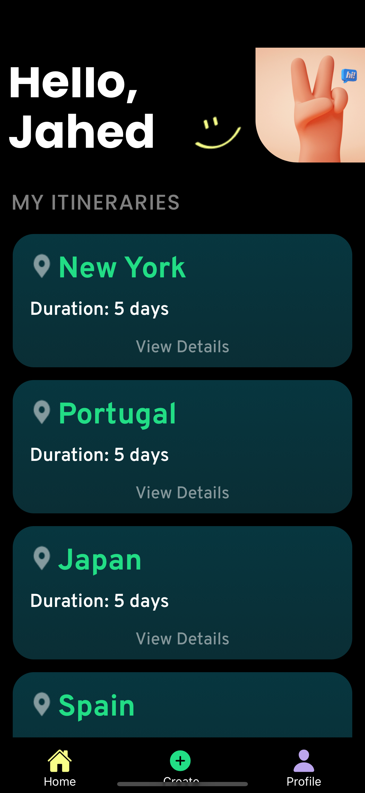
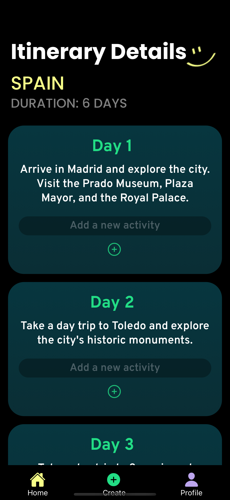

# TrailBlaze - Your Ultimate Travel Itinerary App

Welcome to TrailBlaze, your go-to app for planning and organizing travel adventures!

## Download on the App Store

TrailBlaze is available for download on the Apple App Store. Get it now to start planning your next adventure!

[Link to the App Store]

## Table of Contents

- [Features](#features)
- [Technologies](#technologies)
- [Screenshots](#screenshots)
- [Getting Started](#getting-started)
- [Feedback](#feedback)
- [Privacy Policy](#privacy-policy)
- [License](#license)

## Features

- Create, edit, and organize your travel itineraries with ease.
- Receive personalized recommendations for destinations and activities powered by ChatGPT.
- Secure user authentication and data storage with Firebase.
- Modern and intuitive user interface for a seamless travel planning experience.

## Technologies

- 
- 
- 

## Screenshots

Landing Page

Home Screen

Chat Screen

Itinerary Details

## Getting Started

To get started with TrailBlaze, follow these steps:

1. Create an Account: Begin by downloading the app from the App Store. Sign up for your personalized account to get started.
2. Start a New Trip: To kick off your journey, simply tap the "+" button located at the bottom of your screen. Follow the prompts to enter your destination and travel duration. You can choose to save the itinerary for later or dive right into planning.
3. Add Activities: Enhance your itinerary by clicking the "+" button while viewing your trip plan. Feel free to include your own unique ideas and preferences.
4. Customize: Tailor your adventure to perfection by fine-tuning the AI-generated activities. Make it uniquely yours.
5. Enjoy Your Trip: Follow your meticulously crafted itinerary, embark on exciting explorations, and savor every moment of your travel experience!

## Feedback

https://www.linkedin.com/in/jahedprince/

I am welcome to any feedback from users! Feel free to message me on LinkedIn to proivide your thoughts/opinions.

## Privacy Policy

Before using TrailBlaze, please review our [Privacy Policy](https://www.privacypolicies.com/live/d9816535-11d2-40fd-92bd-15c28a97d754) for information on how we collect, use, and protect your data.

## License

This project is licensed under the MIT License - see the [LICENSE.md](LICENSE.md) file for details.
